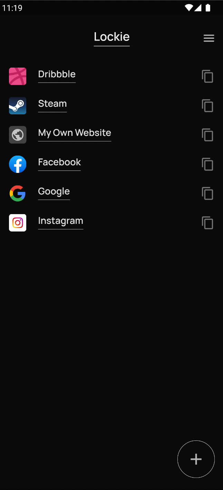
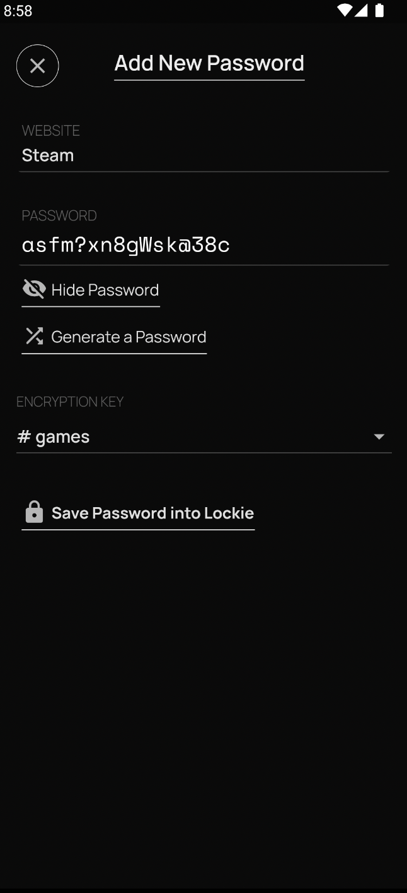
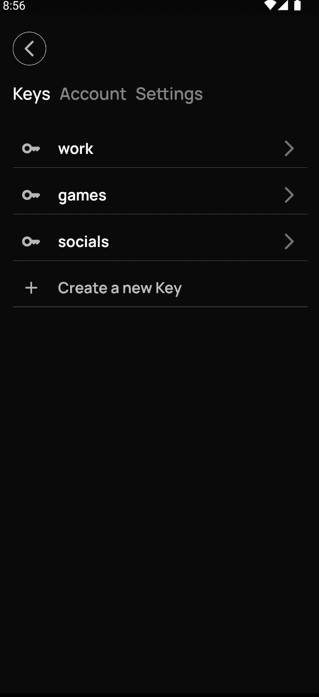

# Lockie

Lockie is a mobile application that protects your passwords using a mix of cloud infrastructure and local disk, fool-proof storage.

  <table>
    <tr>
      <td style="text-align: center">
        
      </td>
      <td style="text-align: center">
        
      </td>
      <td style="text-align: center">
        
      </td>
    </tr>
  </table>

## Features

- Saves your encrypted passwords on the cloud
- Stores your secret keys on local disk
- Beautiful UI built for mobile
- Documentation and easy to understand architecture